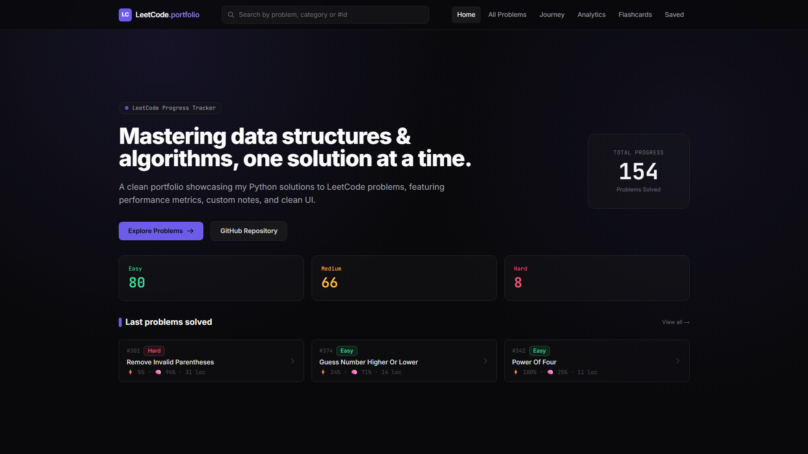
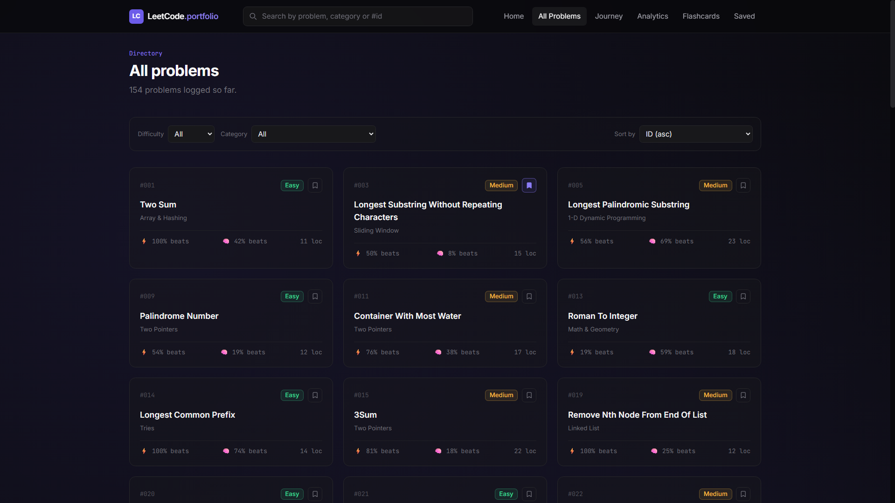
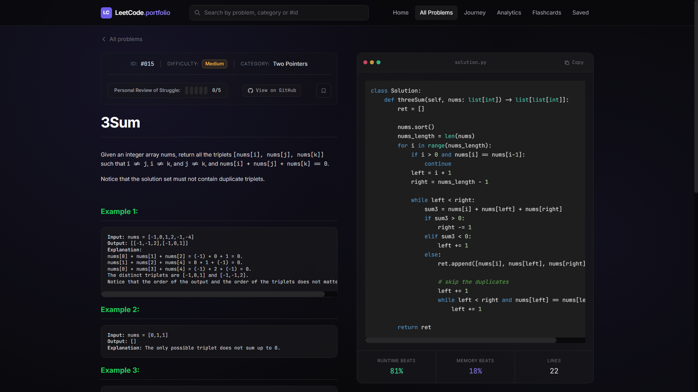
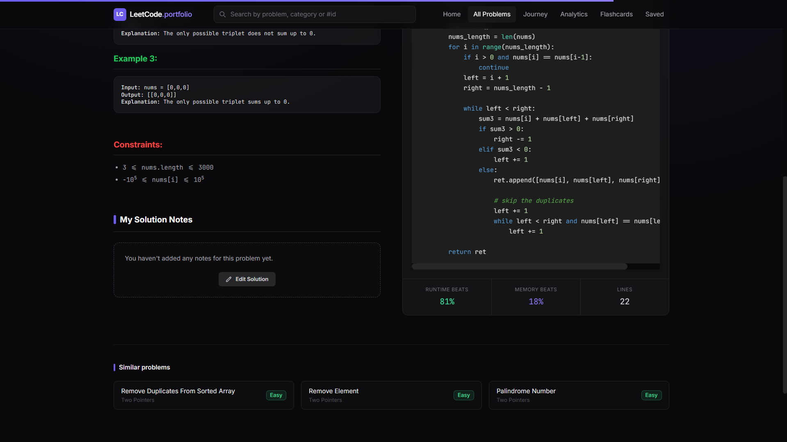
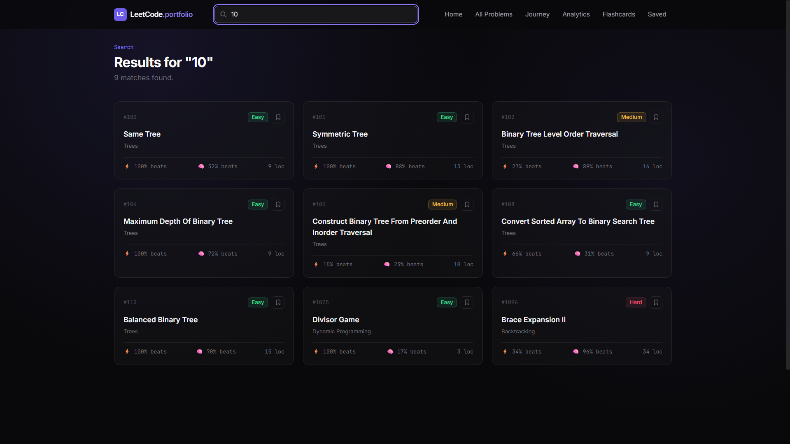
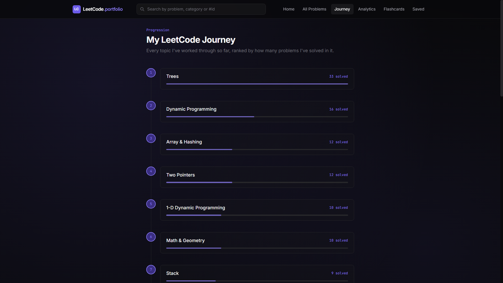
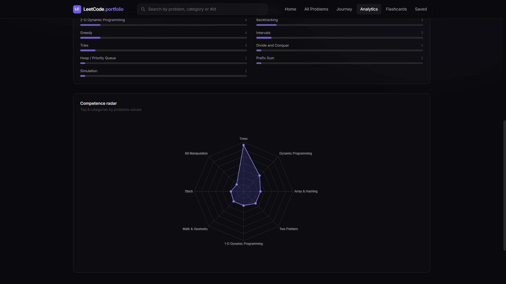
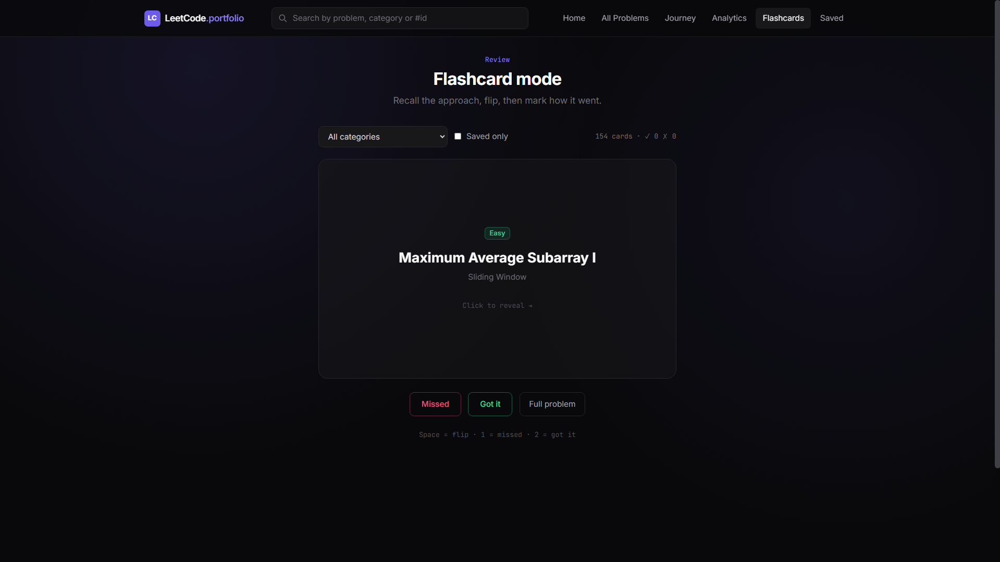
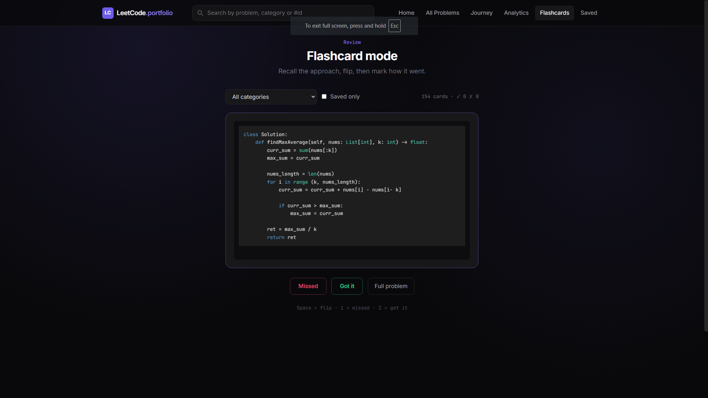

# LeetCode Portfolio

A web app that lists the LeetCode problems I've solved, with my Python solutions, my own notes and a few charts about what I've been practicing.

The solutions themselves live in a separate repo, [leetcode-explained](https://github.com/edvt-exe/leetcode-explained). This project reads that repo, turns it into a JSON database and serves a small site on top of it.



## Pages

### Home

Total solved, the Easy / Medium / Hard split and the latest problems I added. On a desktop screen the page fits the window and doesn't scroll. The screenshot is at the top of this README.

### All problems

Every solved problem as a card, with its difficulty, category, runtime and memory percentile and lines of code. You can filter by difficulty and category, and sort by ID, name or lines of code. Cards load 60 at a time.




### Problem page

The full problem statement next to my solution. The code is highlighted and has a copy button. Below the statement there is a notes box where I explain the approach in my own words. Notes are saved through the API into `database.json`.

Other things on the page:

- a 1 to 5 rating for how much I struggled with the problem
- a bookmark button
- a link to the solution folder on GitHub
- three other problems from the same category




### Search

The search box in the navbar matches on title, category or `#id` and shows the results as the same cards used everywhere else.



### Journey

Categories ranked by how many problems I've solved in each one.



### Analytics

Four views of the same data: a rough count of the data structures I use most, average lines of code per difficulty, coverage by category, and a radar chart of the top 8 categories (Chart.js).

The data structure count is a keyword guess based on the category, title and notes. It is not a real analysis of the code.




### Flashcards

A review mode. It shows a problem title, I try to remember the approach, then flip the card to see my notes and the code. After that I mark it as missed or got it. Missed problems come up more often than the ones I got right.

You can limit the deck to one category or to saved problems only. Space flips the card, `1` marks it as missed and `2` as got it. The results are kept in the browser's localStorage.




### Saved

The problems I bookmarked for later. Bookmarks are also stored in localStorage.


## How it works

```
leetcode-explained  ->  scripts/sync.py  ->  database.json  ->  server.js (API)  ->  public/ (frontend)
```

`sync.py` goes through the solution folders and collects the code, the problem description, the difficulty and the topic tags. The runtime and memory percentiles and the solve date come from the last git commit of each folder. When a category can't be worked out locally, the script asks LeetCode's public GraphQL endpoint for the topic tags.

Running the script again keeps what I wrote by hand: notes and struggle ratings stay as they are.

The API has three routes:

| Method | Route | Purpose |
|--------|-------|---------|
| GET | `/api/problems` | all problems |
| GET | `/api/problems/:id` | one problem |
| PUT | `/api/problems/:id` | update notes and struggle rating |

The frontend is plain JavaScript with hash routing, no framework and no build step.

## Tech stack

- Node.js and Express 5
- Vanilla JavaScript, Tailwind CSS (CDN), highlight.js, Chart.js
- Python 3 for the sync script, standard library only
- GitHub Actions

## Running it locally

You need Node.js 18 or newer, Python 3 and git. Clone this repo and the solutions repo next to each other:

```bash
git clone https://github.com/edvt-exe/leetcode-portfolio.git
git clone https://github.com/edvt-exe/leetcode-explained.git

cd leetcode-portfolio
npm install
npm start
```

Then open http://localhost:3000.

On start the server runs `git pull` in the solutions repo and then `scripts/sync.py`, so the data is current before the first request. If either step fails, the server still starts with the data it already has.

| Variable | What it does |
|----------|--------------|
| `PORT` | port for the server, default 3000 |
| `SOLUTIONS_REPO_PATH` | where the solutions repo is, default `../leetcode-explained` |
| `SKIP_SYNC=1` | skip both the pull and the sync |
| `SKIP_PULL=1` | skip only the `git pull` |
| `PYTHON` | path to the Python executable if the default isn't found |
| `LEETCODE_TAG_LOOKUP=0` | don't call LeetCode for topic tags |

You can also run the sync on its own with `python3 scripts/sync.py`.

## Automatic updates

The workflow in `.github/workflows/sync.yml` runs on every push to `main`. It checks out the solutions repo, runs `sync.py` and commits the updated `database.json`. The commit message contains `[skip ci]` so it doesn't trigger itself.

## Project structure

```
.
├── .github/workflows/sync.yml   sync on push
├── public/
│   ├── index.html               layout, navbar, styles
│   └── app.js                   router and all the pages
├── scripts/sync.py              solutions repo -> database.json
├── database.json                the data
├── server.js                    Express server and API
└── package.json
```